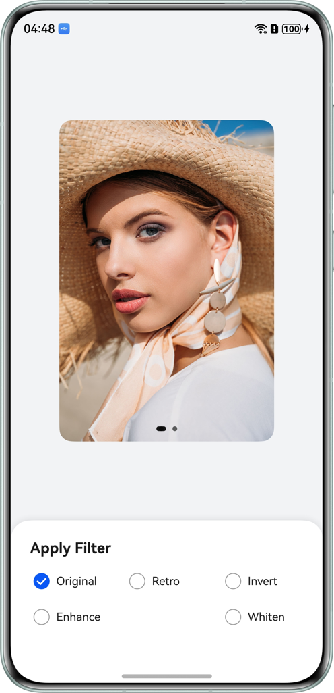
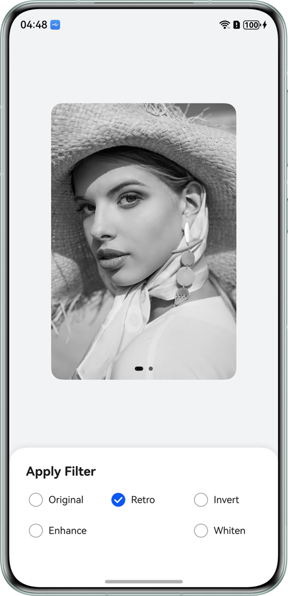
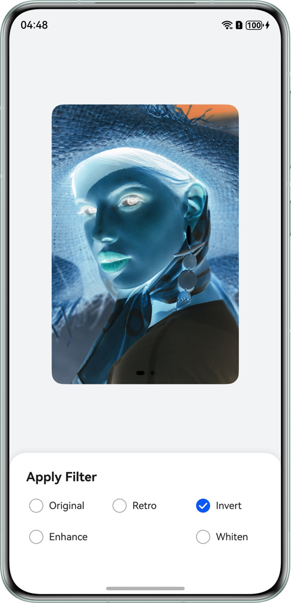
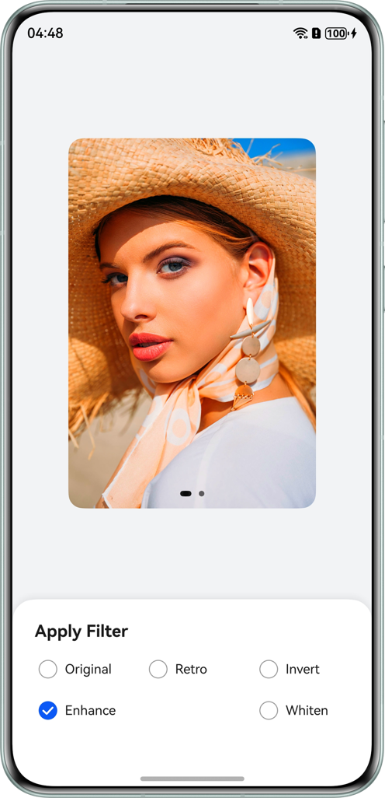
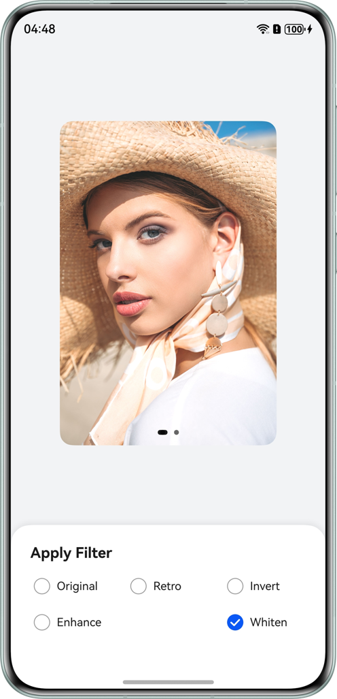

# 基于colorFilter实现图片滤镜效果

## 项目简介

本示例是一个基于`Image`和`Swiper`组件开发的图片滤镜示例应用。该应用不仅演示了如何使用`ColorFilter`对图片进行色彩处理，还实现了一个具有平滑缩放动画的图片轮播功能，支持对每一张图片独立设置滤镜效果。

## 效果预览
|                     原图                     |                     复古                     |                     反色                     |
| :------------------------------------------: | :------------------------------------------: | :------------------------------------------: |
|  |  |  |

|                     增艳                     |                     美白                     |
| :------------------------------------------: | :------------------------------------------: |
|  |  |

## 使用说明

安装运行应用之后，分别点击图片下方的“复古”、“反色”、“增艳”和“美白”单选框，会显示对应的滤镜效果，滑动图片可以对不同的图片添加滤镜效果。

## 工程目录

```
├──entry/src/main/ets/
│  ├──contants
│  │  └──CommonConstants.ets              // 常量类
│  ├──entryability
│  │  └──EntryAbility.ets                 // 程序入口类
│  ├──entrybackupability
│  │  └──EntryBackupAbility.ets           // 数据备份恢复类
│  └──pages
│     └──Index.ets                        // 应用入口页
└──entry/src/main/resources               // 应用静态资源目录
```

## 具体实现

使用 `colorFilter`实现为图像设置颜色滤镜效果，有如下两种方式：

- **矩阵滤镜**: 通过传入一个4x5的RGBA转换矩阵，给图像设置颜色滤镜效果，如 `RETRO_COLOR_MATRIX` 通过修改 RGB 权重实现怀旧色调。
- **颜色滤波器滤镜**: 通过传入一个创建指定的颜色和混合模式的颜色滤波器，实现图形滤镜效果，例如`Whitening` 美白滤镜使用了 `drawing.ColorFilter.createBlendModeColorFilter`，通过 传入ARGB颜色值并设置`BlendMode.PLUS` 模式叠加白色层来实现提亮效果。


## 相关权限

不涉及。

## 约束与限制

1. 本示例仅支持标准系统上运行，支持设备：华为手机。
2. HarmonyOS系统：HarmonyOS 6.0.0及以上。
3. DevEco Studio版本：DevEco Studio 6.0.0及以上。
4. HarmonyOS SDK版本：HarmonyOS 6.0.0 SDK及以上。